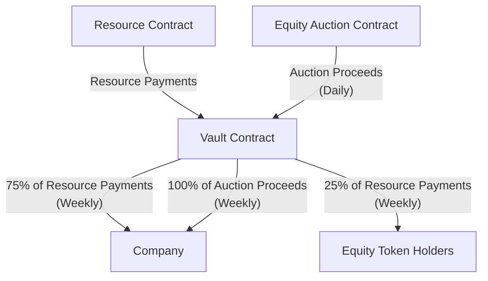

## AIBTCdev Thursday, Mar 28

[Video + Recap: Thursday, Mar 28](https://twitter.com/whoabuddydev/status/1773485657534664711)

### Working Group Updates

[Ready Layer 2 competition](https://readyl2.com) wrapping up

- 36 submissions, ~ half using AI in some way
- lots of Clarity code, great to see!
- saw some cool projects
  - Clarity, open source, readable, decidable, perfect fit for LLMs
  - golang tooling we want to enable for agents (@davek-btc)
  - AI deployments, analysis, audits, and more
- Results coming soon, [view the project list](https://readyl2.devpost.com/project-gallery)
- Xverse released a new library, STX + BTC in the same lib!

### Latest AI News

Shout out to @dreight for helping source the news this week! This prompted some great discussion among the group.

- [Fine-tunes in GPT4 see performance degradation](https://the-decoder.com/supersimple-fine-tunes-gpt-4-and-sees-diminishing-returns-in-performance-leaps/)
- [Sakana AI paper on combining smaller models to build new ones](https://x.com/AlphaSignalAI/status/1771201081734811797)
- [Claude 3 Opus takes lead, Haiku performs strong on Chatbot Arena Leaderboard](https://huggingface.co/spaces/lmsys/chatbot-arena-leaderboard)
  - Amazon invested $2.75B in Anthropic (maker of Claude)
- [Generative AI is coming to finance](https://the-decoder.com/financial-sector-embraces-generative-ai-and-expects-widespread-adoption-in-two-years-study-finds/)
- [DataBricks released a new SOTA LLM](https://www.databricks.com/blog/introducing-dbrx-new-state-art-open-llm)

### Development Updates

Smart contract name updates

- removing last of stacks-m2m naming
- preparation for Nakamoto Testnet
- teaser: shifting focus from [testnet to mainnet](https://github.com/aibtcdev/smart-contracts/issues/2) with an MVP

#### New Idea: Sharing Revenue

With Clarity smart contracts we can expand beyond just pay-per-use.

If we think of a Crew as a resource and a company as the resource provider, then the company would be deploying the initial contract and managing payouts.

What if we took this a step further? We could set up a contained system where:

- the company deploys a resource contract, their own token, and a vault
- the resource contract tracks users, invoices and payments
- the token contract is minted in batches through an ongoing daily auction
- the vault contract holds payments for resources and auction payments

The auctions for the token would happen daily (every 144 Bitcoin blocks) and the vault
will count the auction payouts and resource payments for a 1 week period (every 1,008 blocks).

When that 1 week period ends is where it gets interesting!

- the company (contract owner) can withdraw 100% of winning auction bids
- the company (contract owner) can withdraw 75% of payments
- the token holders (shareholders) can withdraw 25% of payments, based on how much of the token they hold

This gives people an easy way to speculate and take part in a company that offers resources, and implements a very basic but powerful revenue sharing model as a template for others to deploy.

It also brings all of the payments and flows on-chain, which provides transparency into the resources, the vault, and the token. Anyone can query the blockchain for the info.

Here is the code for a basic diagram (image below):

The incentive for companies is to provide services that generate revenue. Participants in the auction can speculate on the success of the company and are entitled to their share of the 25% from the revenue.

We will be working to get an MVP of this implemented ASAP, if this sounds interesting to you definitely reach out!

### How to get involved

As the working group grows there is space for people to contribute in various ways:

- review and ask questions to [expand documentation](https://docs.aibtc.dev)
- front-end development for displaying contract information
- back-end development for querying/storing blockchain data
- smart contract development for on-chain functionality
- running Local LLMs and working with crews
- generating training data based on Stacks resources

Try things, experiment, embrace the mess!
